# Charts
## All Providers
### Daily Coverage
Amount of coverage, actions against all known Disposable Email Providers per Day
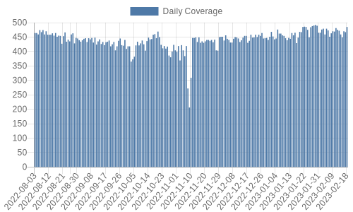

### Daily Unique Disposable Domains
Number of unique known validated Disposable Domains in Total at given Day

## Success Rate
Per Provider Success Rate per Day - A lower Success rate might mean different things; counter measures from provider to be detected like capchas or even service downtime.

### 10-minute-mail.com

### 10-minuten-mail.de

### 10mails.net

### 10minemail.com

### 10minut.com.pl

### 10minut.xyz

### 10minuteemails.com

### 10minutemail.co.za
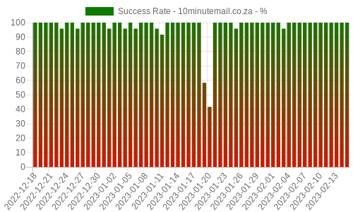

### 10minutemail.com
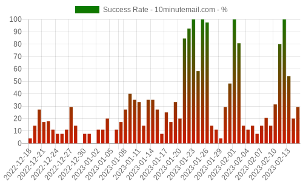

### 10minutemail.info
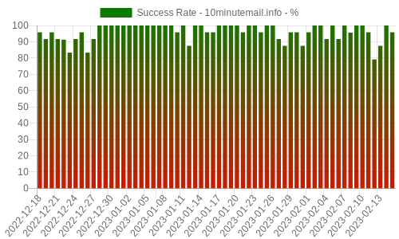

### 10minutemail.net
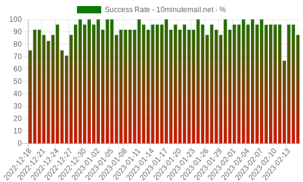

### 10minutemail.org
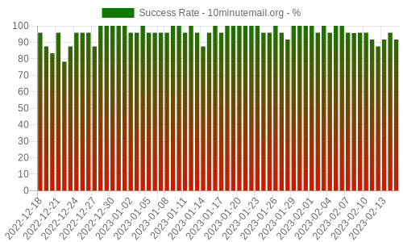

### 10minutesemail.net
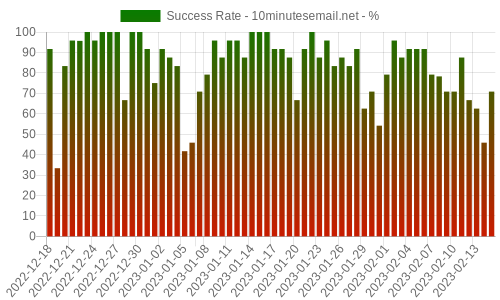

### 10minutesmail.us

### 1secmail.com

### 20minutemail.com

### 24mail.chacuo.net

### abandonmail.com
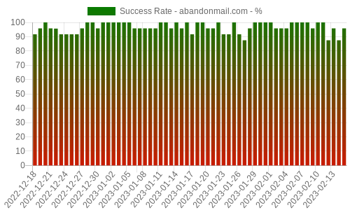

### airmailbox.website

### altmails.com

### another-temp-mail.com

### brodilla.email

### byom.de

### cryptogmail.com
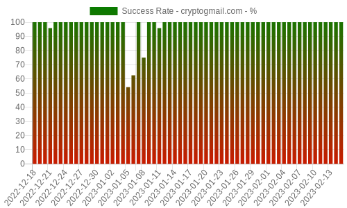

### default.tmail.thehp.in
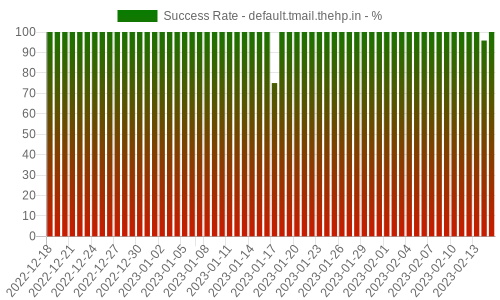

### developermail.com
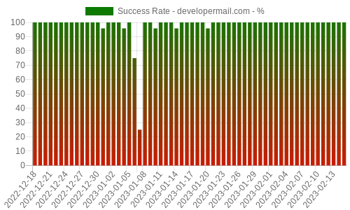

### dispemail.com

### disposableemail.us
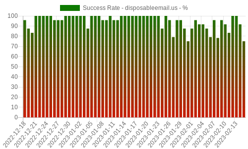

### disposablemail.com

### disposeamail.com

### dispostable.com
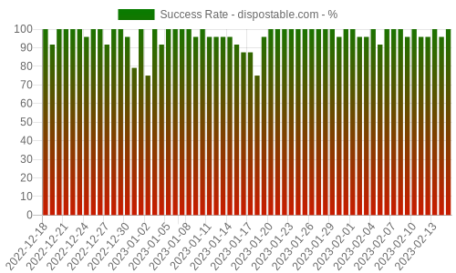

### dodsi.com

### dropmail.me
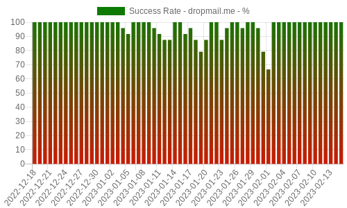

### easytrashmail.com

### email-fake.com
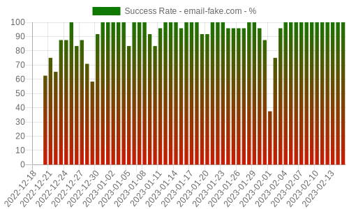

### emailfake.com
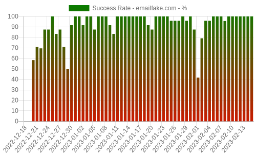

### emailondeck.com

### eyepaste.com
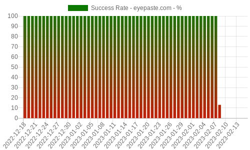

### fakemail.io

### fakemail.net

### fakemailgenerator.com
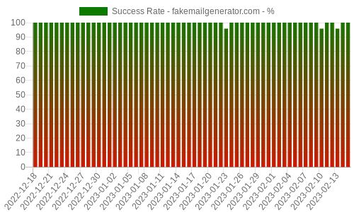

### fakermail.com

### fex.plus

### findtempmail.com
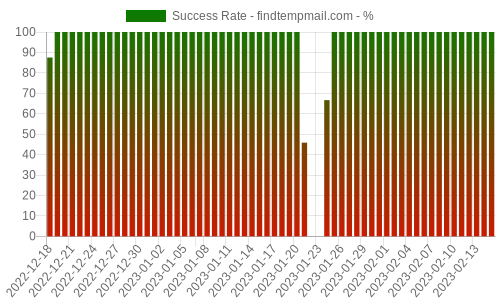

### foxiomail.com

### fyii.de
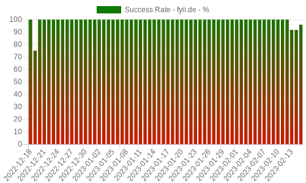

### gecicimail.co
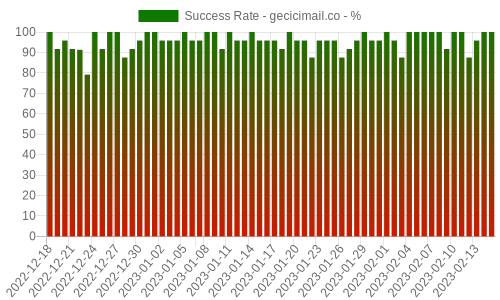

### gecicimail.com.tr
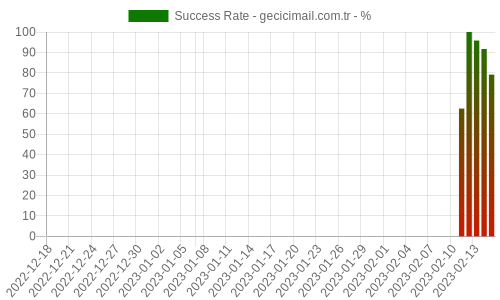

### generator.email
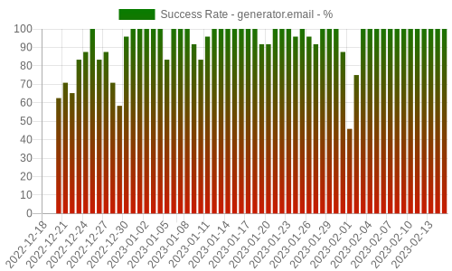

### getnada.com
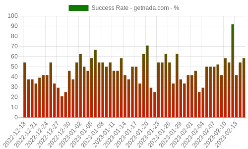

### gettempmail.com

### gpa.lu

### guerrillamail.com

### harakirimail.com

### haribu.net

### hizli.email
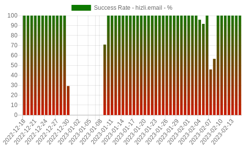

### hottempmail.com
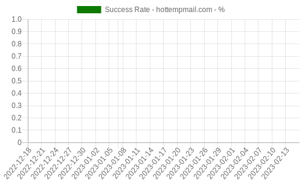

### instant-email.org

### instantemailaddress.com
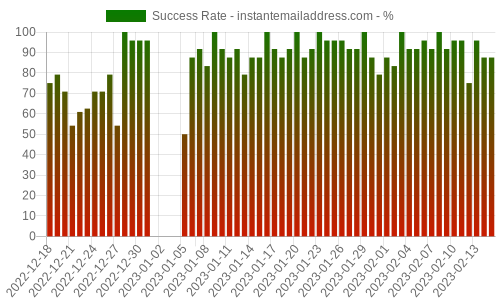

### jooko.info
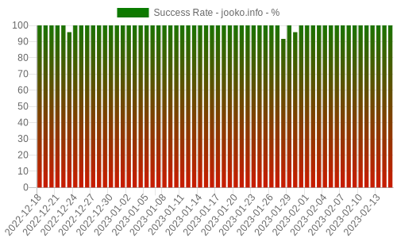

### linshi-email.com

### lroid.com

### luxusmail.org
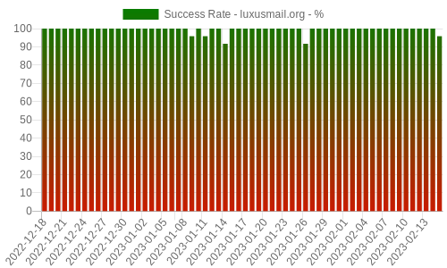

### mail-temp.com

### mail.gen.tr
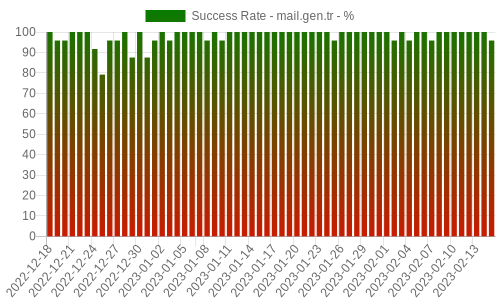

### mail.gw

### mail.tm

### mail1a.de
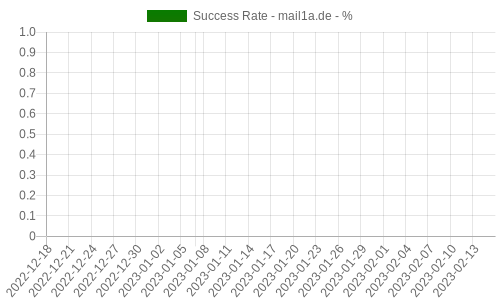

### mail7.io

### mailcatch.com

### maildim.com

### maildrop.cc
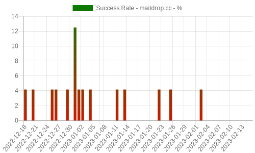

### mailinator.com

### mailnesia.com

### mailpoof.com

### mailsac.com

### mailswipe.net

### minimail.eu.org

### mintemail.com
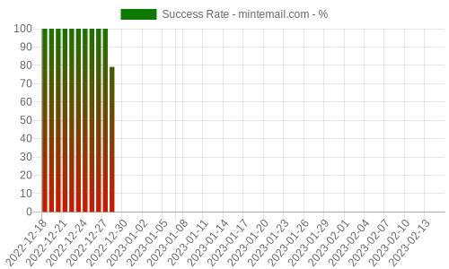

### minuteinbox.com

### moakt.com

### mohmal.com

### muellmail.com

### mytemp.email

### mytrashmailer.com

### niepodam.pl

### nolog.email
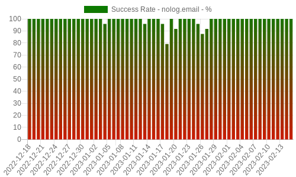

### onetempmail.com

### phaantm.de

### poo.email

### shitmail.me

### shitmail.org
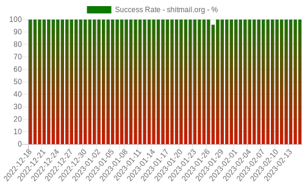

### spamdecoy.net
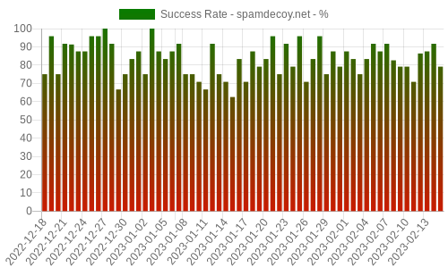

### spamgourmet.com

### spoofmail.de

### t-mail.org
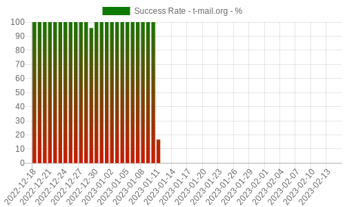

### temp-inbox.com
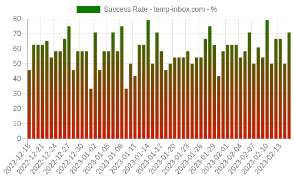

### temp-mail.io
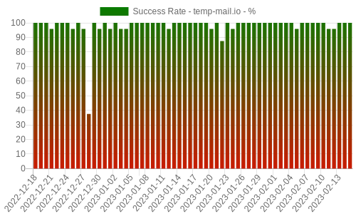

### temp-mail.org

### temp-mails.com

### temp.cab
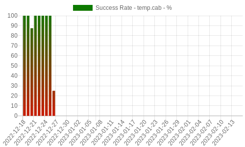

### tempail.com
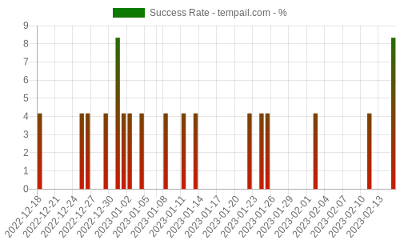

### tempinbox.xyz
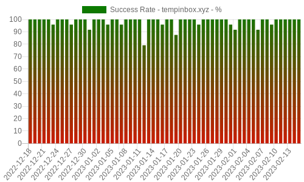

### tempmail.altmails.com
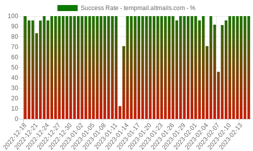

### tempmail.cn

### tempmail.co

### tempmail.dev
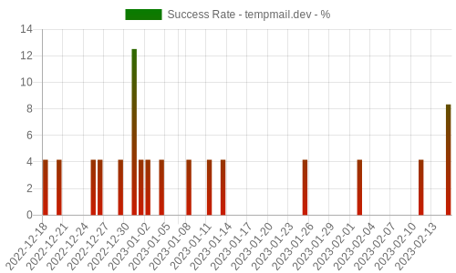

### tempmail.net

### tempmail.ninja
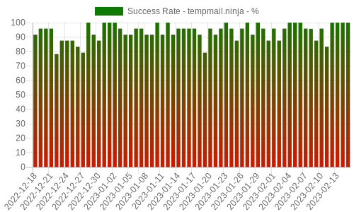

### tempmail.tel

### tempmailed.com
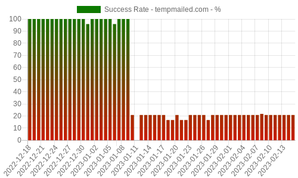

### tempmailid.com

### tempmailo.com

### tempo-email.com
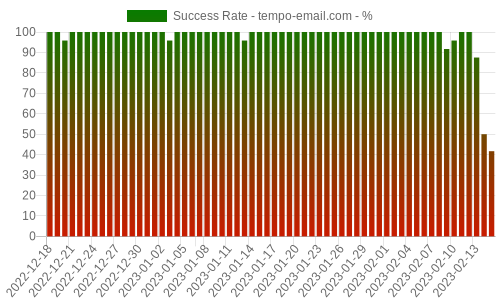

### tempo-mail.xyz

### temporary-mail.net
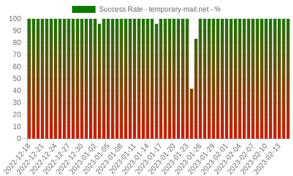

### temporarymail.com
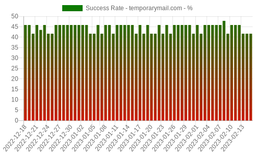

### tempos.email

### tempr.email
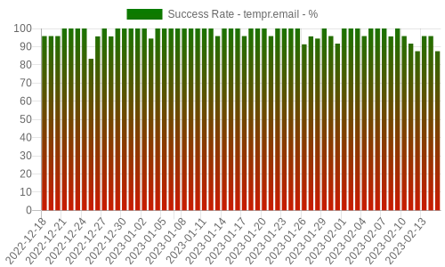

### temprmail.com

### tenmail.org

### throwaway.io

### throwawaymail.com

### tmailweb.com

### trash-mail.com

### trashmail.com

### trashmail.de

### trashmail.live

### trashmail.org

### trashmail.ws

### trashmails.com

### txen.de

### wegwerfemailadresse.com

### yopmail.com

### yopmail.fr

### yopmail.net

### yourmail.online

